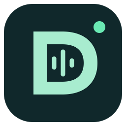
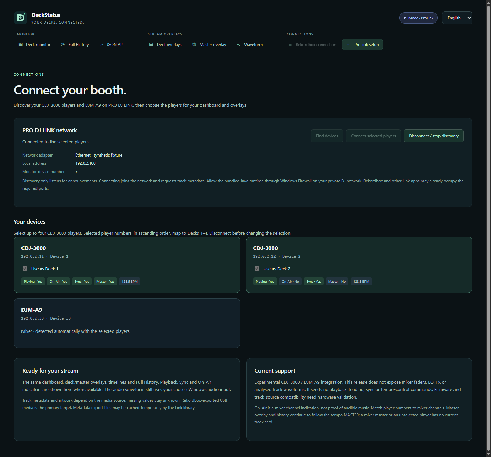
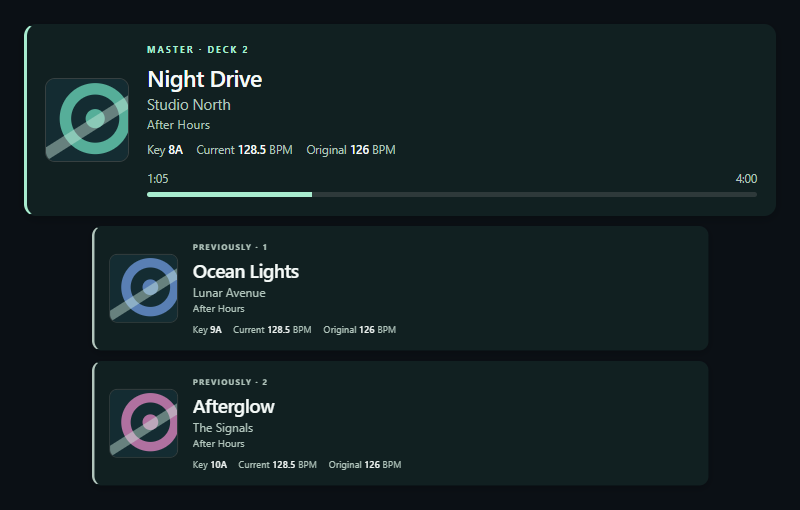
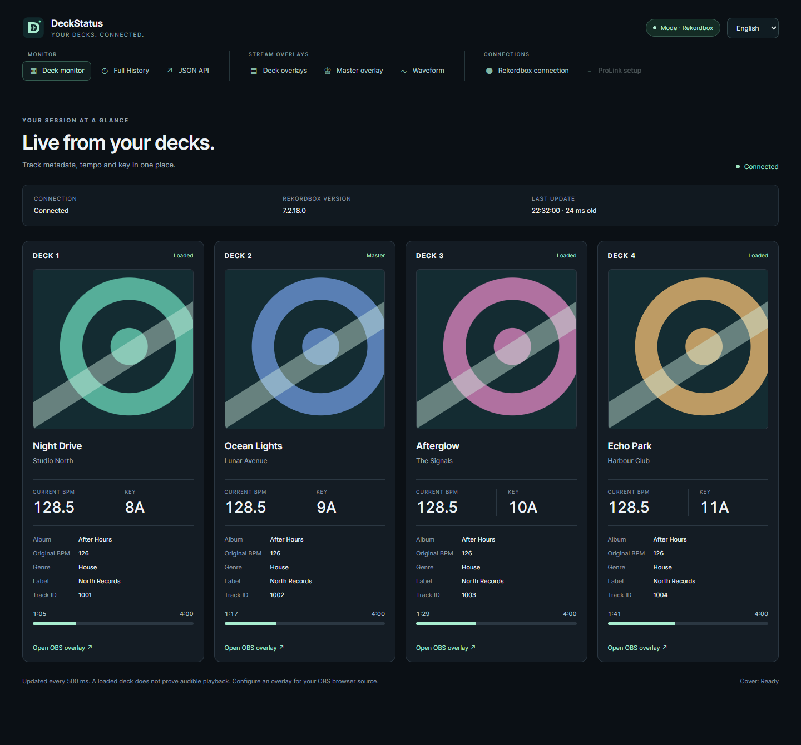
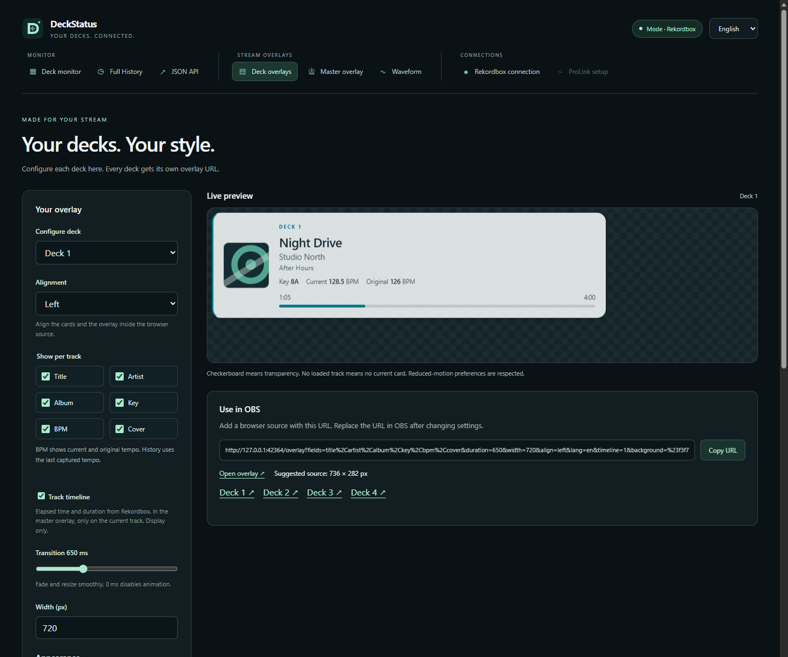
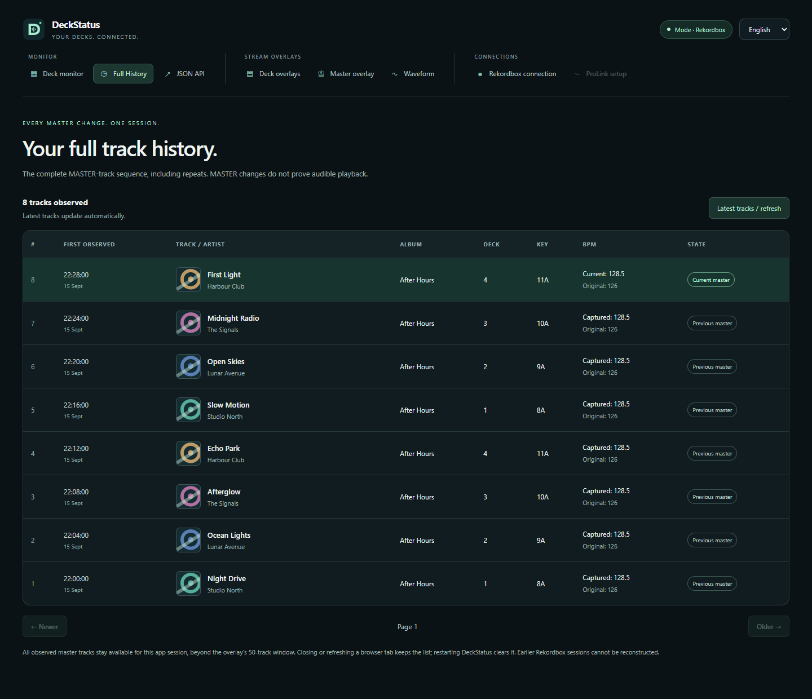
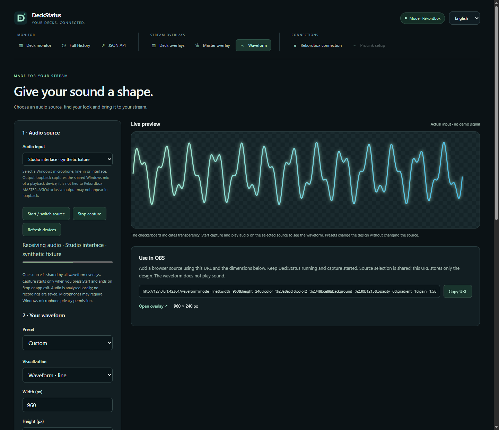

# 🎛️ DeckStatus



**Version 1.4.0** · [📦 Windows-Download](https://github.com/spartokos99/DeckStatus/releases/tag/v1.4.0) · [Änderungen](CHANGELOG.md)

[English](README.md) · Deutsch

## 🔌 Neu in 1.4.0: ProLink

**`Start-ProLink.cmd`** oder **`DeckStatus.exe --mode prolink`** startet die Netzwerk-Anbindung. Unter **ProLink-Setup** Geräte suchen, bis zu vier CDJ-3000 auswählen und verbinden. Playernummern werden aufsteigend den Decks 1–4 zugeordnet; der DJM-A9 wird automatisch erkannt.

Die gruppierte Navigation zeigt immer beide Verbindungen und den aktuellen Modus. Funktionen des anderen Modus sind deaktiviert und auch per API gesperrt. Dashboard, Overlays, Timelines und Full History sehen in beiden Modi gleich aus. Auf der Setup-Seite kommen Wiedergabe-, Sync- und On-Air-Anzeigen hinzu. Die Audio-Waveform nutzt weiterhin einen Windows-Audioeingang.

**Der normale Start mit `DeckStatus.exe` bleibt unverändert im Rekordbox-Modus.** Die portable ZIP enthält die benötigte Java-Laufzeit. Für den vollständigen Quell-Build werden zusätzlich JDK 21+ und beim ersten Mal Internet benötigt; alle Downloads sind per SHA-256 festgelegt.



Primäres Ziel sind mit Rekordbox exportierte USB-Medien. Andere Modelle, Firmwarekombinationen, Streaming und Device Library Plus-only sind nicht validiert. Mixer-Fader, EQ/FX und analysierte Track-Waveforms sind nicht implementiert. Es werden keine Wiedergabe-, Lade- oder Tempo-Steuerbefehle gesendet. [Ausführliche ProLink-Dokumentation](docs/prolink.md).

**Geprüft für 1.4.0:** sieben native Tests, Java-Modelltests und vier Browser-Suiten. Die bestehenden Live-Nachweise für Rekordbox 7.2.18.0 bleiben gesondert gültig; ein Live-Test am CDJ-/DJM-Setup wird nicht behauptet.

> **Rekordbox-Modus: nur mit der eigenen Rekordbox-Installation 7.2.18.0 unter Windows x64 getestet.**
> **ProLink: experimentelle CDJ-3000-/DJM-A9-Unterstützung. Bisher nur mit synthetischen Tests geprüft, nicht an echter Hardware.**
> Andere Versionen, EXE-Builds, Betriebssysteme und der Export-Modus sind nicht validiert. Die Bridge ist auf den dokumentierten Build abgestimmt und lehnt unpassende Builds ab.

Windows-x64-Programm für **Rekordbox 7.2.18.0** mit einer DLL, die im laufenden Rekordbox Deckdaten ausliest, und einem separaten lokalen HTTP-Server. Enthalten sind ein Dashboard, konfigurierbare Deck-Overlays und ein Master-Overlay mit History und optionaler Timeline. Mit vier geladenen Decks einschließlich Metadaten und Cover sowie Master-Wechseln live geprüft.



*📸 Alle Screenshots zeigen die englische Oberfläche mit englischen synthetischen Trackdaten bzw. einem gekennzeichneten Test-Audiosignal.*

## 🚀 Starten

1. Rekordbox 7 starten und in den Performance-Modus wechseln.
2. `build\Release\DeckStatus.exe` starten (im fertigen ZIP direkt `DeckStatus.exe`). `DeckStatusBridge.dll` und der Ordner `web` müssen daneben liegen.
3. Im Browser **http://127.0.0.1:18740/** öffnen und einen Track ins Deck laden.

Beenden mit **Strg+C**. Die DLL beendet ihren Worker und entlädt sich. Nach einem Rekordbox-Neustart die Bridge ebenfalls neu starten. Bei mehreren Rekordbox-Prozessen mit `--pid` auswählen. Rekordbox und Bridge unter demselben Windows-Benutzer und mit denselben Benutzerrechten ausführen.

```powershell
.\build\Release\DeckStatus.exe
.\build\Release\DeckStatus.exe --port 18741
.\build\Release\DeckStatus.exe --pid 1234
.\build\Release\DeckStatus.exe --database 'D:\DJ Library\master.db'
```

Die Browseranzeige lässt sich ohne Rekordbox ausprobieren. Der Demo-Modus kennzeichnet seine synthetischen Daten ausdrücklich:

```powershell
.\build\Release\DeckStatus.exe --demo
```

## 🌍 Sprache und Deck-Einstellungen

Die Startseite verlinkt auch **Waveform** und **Full History**. Alle Web-Kopfzeilen nutzen dieselbe Logo-Vorlage wie das EXE-Icon. Jede der vier Deckkarten zeigt eine Timeline mit Position und Gesamtdauer; fehlende oder veraltete Zeiten werden als nicht verfügbar gekennzeichnet.

**Deck 1–4 konfigurieren:** http://127.0.0.1:18740/overlay/settings

Eine gemeinsame Seite enthält eine Deck-Auswahl. Jedes Deck speichert seine eigene Konfiguration im Browser und bekommt eine eigene OBS-URL. „Auf alle Decks anwenden“ übernimmt das aktuelle Design für alle vier Decks. Die Links darunter öffnen die jeweiligen fertig konfigurierten Overlays. Das Dashboard verwendet ebenfalls diese gespeicherten Deck-Einstellungen für seine Overlay-Links.

**English ist Standard.** Oben im Dashboard und auf allen Einstellungsseiten zwischen **English** und **Deutsch** wechseln. Die Auswahl bleibt im Browser gespeichert; fertige OBS-URLs enthalten die Sprache explizit als `lang=en` oder `lang=de`. Die Konsole startet auf Englisch und lässt sich mit `DeckStatus.exe --lang de` einschließlich Hilfe und Diagnosen auf Deutsch umstellen. Die Sprachdateien liegen in `web/locales/en.json` und `de.json`; Tracktitel und andere Bibliotheksdaten werden unverändert angezeigt.



## 🎨 Gestaltung und Timeline

Beide Overlay-Typen bieten dieselben Gestaltungsoptionen: Presets **Midnight**, **Light** und **Minimal / transparent**, vier Farben (Hintergrund, Text, sekundärer Text und Akzent), Hintergrundtransparenz, drei Schriftfamilien, Titelgröße, Covergröße, Innenabstand, Trackabstand, Rundungen, Akzentrahmen, Schatten und Deck-/Master-Beschriftungen. Das Cover kann neben oder über dem Text stehen. Die Demo-Kennzeichnung bleibt im Demo-Modus sichtbar.

**Track-Timeline** blendet verstrichene Zeit, Gesamtlänge und einen Fortschrittsbalken ein. Die Position kommt aus Rekordbox und folgt auch Cue-/Suchsprüngen. Negative Vorlaufpositionen bleiben als negative Zeit sichtbar; der Balken bleibt innerhalb von 0–100 %. Bei fehlenden Zeitdaten erscheinen Striche und ein Hinweis. Die Anzeige rechnet die Position bei pausierten Decks nicht künstlich weiter.

Im Master-Overlay hat **ausschließlich der aktuelle Master** eine Timeline. History-Karten zeigen keine Timeline. Es handelt sich um eine visuelle Anzeige ohne Audioausgabe, Wellenform oder Steuerung von Wiedergabe und Suchposition.

Alle Optionen stehen in der erzeugten URL. Nach Änderungen die Browserquellen-URL in OBS ersetzen. Ohne `timeline=1` bleibt die Timeline aus; vorhandene URLs funktionieren weiterhin.




## 👑 Master-Overlay mit History

**Einstellungen und Live-Vorschau:** http://127.0.0.1:18740/master-overlay/settings

1. Die Anzahl vorheriger Tracks einstellen: **0–50**. Der aktuelle Master steht oben, der zuletzt vorherige Track direkt darunter.
2. **Größe vorheriger Tracks** mit dem Slider von **0,20× bis 1,00×** einstellen. Die gesamte Karte einschließlich Cover und Schrift wird proportional skaliert; der aktuelle Master bleibt bei 1,00×. Die Abstände berücksichtigen die kleinere Kartenhöhe.
3. **Linksbündig, mittig oder rechtsbündig** wählen. Das richtet sowohl die kleineren History-Karten zum Master als auch das gesamte Overlay innerhalb einer größeren Browserquelle aus.
4. **Titel, Artist, Album, Key, BPM und Cover** einzeln ein- oder ausblenden. Die Auswahl gilt für jeden Track. Das BPM-Feld zeigt **Aktuell** und **Original** gemeinsam; auch das Deck-Overlay zeigt beide Werte.
5. Übergangsdauer (**0–2000 ms**, Standard 650 ms) und Breite einstellen. Auch die Größenänderung vom Master zur History erfolgt animiert.
6. Die erzeugte URL kopieren und als **OBS-Browserquelle** einsetzen. Empfohlene Quellengröße steht neben dem Link; darin sind 8 Pixel Außenabstand enthalten. Nach einer Einstellungsänderung die URL in OBS ersetzen.

Direktes Beispiel mit History auf 65 % und rechter Ausrichtung: http://127.0.0.1:18740/master-overlay?history=5&fields=title,artist,album,key,bpm,cover&duration=650&width=720&historyScale=0.65&align=right

`historyScale` akzeptiert 0.20–1.00, `align` die Werte `left`, `center` und `right`. Bestehende URLs ohne diese Parameter verwenden weiterhin 1,00× und linksbündige Ausrichtung.

Das Overlay folgt der **MASTER-Markierung in Rekordbox**, auch wenn das Deck pausiert. Es bestimmt nicht, welches Deck gerade hörbar ist. Ohne eindeutigen Master, bei leerem Master-Deck oder Verbindungsverlust wird der aktuelle Track ausgeblendet. Vorhandene History bleibt sichtbar. Die Karten blenden weich ein/aus und rücken animiert nach; laufende BPM-Updates lösen keinen neuen Übergang aus. Die Systemoption „Bewegung reduzieren“ deaktiviert die Animation.

Die History wird im Server gesammelt, auch wenn kein Browser geöffnet ist, und übersteht das Neuladen der Browserquelle. **Ein Neustart der Bridge leert die History.** Ein anderer Master-Track erzeugt einen Eintrag; derselbe Track auf einem anderen Deck erzeugt keinen doppelten Eintrag. Ein später erneut aufgelegter Track wird als neuer Eintrag in der Master-Abfolge geführt. Eine vorübergehend fehlende Master-Markierung erzeugt keinen zusätzlichen Eintrag. History-BPM werden beim Verlassen des Masters eingefroren, fehlende Metadaten werden nachgeladen. Die History dokumentiert Master-Wechsel, keine nachgewiesenen Wiedergaben.

„Aktuell“ bezeichnet beim Master bzw. ausgewählten Deck das aktuelle Decktempo, in der History das beim Master-Wechsel zuletzt erfasste Tempo. „Original“ ist das analysierte Tempo aus der Bibliothek. Fehlende BPM-Werte erscheinen als „—“.

Beim Umstieg auf DeckStatus werden die bisher gespeicherte Sprache und Overlay-Einstellungen auf demselben Browser-Ursprung automatisch übernommen. Alte Overlay-URLs funktionieren weiter. Vor dem Start von `DeckStatus.exe` die vorherige Instanz beenden.

Die Einstellungen einschließlich Skalierung und Ausrichtung bleiben im verwendeten Browser gespeichert; die OBS-URL enthält die vollständige Konfiguration und funktioniert unabhängig davon. Der Demo-Modus wechselt alle acht Sekunden zwischen zwei deutlich gekennzeichneten Beispieltracks.

## 📜 Full History

Der neue Tab **Full History** (deutsch: „Gesamte History“) unter **http://127.0.0.1:18740/history** enthält die vollständige erfasste MASTER-Track-Abfolge der aktuellen App-Sitzung, einschließlich Wiederholungen nach anderen Tracks. Ältere Einträge bleiben auch außerhalb des 50-Track-Fensters des Overlays erhalten.

Die Tabelle zeigt Titel, Artist, Cover, Album, Deck, Key, Erfassungszeit sowie erfasste und originale BPM. Der aktuelle Master wird markiert. Die Liste ist absteigend sortiert und in Seiten zu 100 Einträgen aufgeteilt. Ältere Seiten verschieben sich bei neuen Trackwechseln nicht; „Neueste Tracks / aktualisieren“ kehrt zur Live-Liste zurück.



Die Sammlung beginnt beim Beobachten durch DeckStatus. Ein Browser-Neuladen erhält sie; **ein App-Neustart leert sie**. Vorherige Sitzungen können nicht nachträglich rekonstruiert werden. Master-Wechsel sind kein Nachweis hörbarer Wiedergabe; das Laden eines Nicht-Master-Decks allein erzeugt keinen Eintrag. Bei Verbindungsverlust bleibt der zuletzt erfasste Track ohne Live-Markierung in der Liste.

## 〰️ Audio-Waveform · neu in 1.3.1

Öffne **http://127.0.0.1:18740/waveform/settings**. Die **erste Einstellung ist der Audioeingang**: Windows-Mikrofon, Line-in, Interface oder Ausgabe-Loopback wählen und **Start / Quelle wechseln** drücken.

- Sechs Presets: Mint-Linie, Neon-Spektrum, Sunset-Spiegel, Minimal Weiß, Orbit und Signalband.
- Linie, gefüllte Waveform, Spektrumbalken, gespiegeltes Spektrum, Kreis oder Amplitudenverlauf.
- Farben, Farbverlauf, Transparenz, Breite/Höhe, Empfindlichkeit, Glättung und Rauschschwelle.
- Linienbreite, Balkenanzahl/-abstand/-rundung, Leuchten, Nachleuchten, Raster und Mittellinie.
- Linker/rechter Kanal oder Stereomix, Frequenzbereich, Verlaufsdauer, 30/60-FPS-Limit und Ausblenden bei Stille.
- Live-Vorschau, gespeichertes Design und eigene OBS-URL.



**Alle Waveform-Overlays teilen eine Audioquelle.** Die Erfassung ist nach jedem App-Start ausgeschaltet und wird explizit gestartet/gestoppt. Das Schließen der Einstellungsseite beendet eine laufende Erfassung nicht; dafür Stopp drücken oder DeckStatus beenden. Die URL speichert nur das Design.

WASAPI erfasst Audio im separaten Host. Es wird weder wiedergegeben noch in Dateien gespeichert oder hochgeladen. Ausgabe-Loopback zeigt den gemeinsamen Windows-Mix des gewählten Geräts und folgt **nicht** Rekordbox MASTER. ASIO/exklusive Ausgabe ist eventuell nicht verfügbar; dann einen passenden Windows-Eingang verwenden. Mikrofone benötigen gegebenenfalls eine Windows-Datenschutzfreigabe. Mehrkanalgeräte verwenden aktuell das erste Stereopaar, Mono wird dupliziert.

Die Darstellung nutzt die letzten 1.024 Samples je Kanal, keine vorberechnete Waveform des gesamten Tracks. Abruf etwa alle 40 ms plus Anfragezeit; der Verlauf zeigt abgetastete Amplituden, keine lückenlose Audioaufzeichnung. Veraltete Signale verschwinden. Auch im Demo-Modus wird kein Waveform-Audiosignal erfunden.

Das neue mintfarbene **D mit Audiosignal** ist als Windows-Icon in neun Auflösungen von 16 bis 256 px direkt in der EXE eingebettet.

Für die fertige App das vollständige **DeckStatus-1.4.0-win-x64.zip** aus dem [GitHub-Release](https://github.com/spartokos99/DeckStatus/releases/tag/v1.4.0) entpacken. [Technische Audio-Dokumentation](docs/audio-waveform.md).

## 🌐 HTTP-API

| Adresse | Inhalt |
|---|---|
| `/` | Dashboard mit vier Decks |
| `/waveform/settings` | Audioquelle, Waveform-Design, Vorschau und OBS-URL |
| `/waveform` | Transparente Audio-Visualisierung |
| `/api/audio/devices` | Aktive Windows-Eingänge und Ausgabe-Loopback-Geräte |
| `/api/audio/state` | Erfassungsstatus, Signalalter und letztes Stereo-Samplefenster |
| `POST /api/audio/source` | JSON `{"deviceId":"…"}` wählt eine Quelle; `{"deviceId":""}` stoppt |
| `/api/state` | Gesamtzustand, Version, Diagnose und Deckdaten |
| `/api/decks` | Array der vier Decks |
| `/api/decks/1` | Deck 1; Nummern 1–4 |
| `/api/decks/1/cover` | Coverbild; 404, wenn kein Cover verfügbar ist |
| `/api/health` | 200 bei verbundenem Deckzugriff oder Demo, sonst 503 |
| `/overlay?deck=1` | Transparente OBS-Browserquelle für das gewählte Deck |
| `/overlay/settings` | Deck 1–4 konfigurieren, Live-Vorschau und getrennte OBS-URLs |
| `/master-overlay/settings` | Master-Overlay konfigurieren, Live-Vorschau und OBS-URL |
| `/master-overlay` | Transparente Browserquelle für Master und History |
| `/api/master` | Aktueller Master-Eintrag und bis zu 50 vorherige Einträge |
| `/history` | Vollständige History dieser App-Sitzung |
| `/api/history` | Alle erfassten Master-Tracks, neueste zuerst; `limit=1…100`, optional `before` als positive Eintrags-ID |
| `/api/history/covers/123` | Cover eines beliebigen während dieser Sitzung erfassten Tracks |
| `/api/master/covers/123` | Cover zu einer Track-ID in der Master-Session; auch nach Deckwechseln |

Track-Endpunkte sind nur lesend. `POST /api/audio/source` startet, wechselt oder stoppt explizit die Audioerfassung; es steuert Rekordbox nicht. Der Server lauscht ausschließlich auf `127.0.0.1`; keine Firewall-Freigabe erforderlich. Lokale Programme können die API direkt abrufen. Browserzugriffe von anderen Websites sind gesperrt.

Deckdaten umfassen `id`, `trackId`, `loaded`, `metadataAvailable`, `isMaster`, `title`, `artist`, `album`, `key`, `genre`, `label`, `bpm`, `originalBpm`, `positionMs`, `durationMs` und `coverUrl`. `bpm` ist das aktuelle Decktempo, `originalBpm` das analysierte Tracktempo. `positionMs` ist die aktuelle Position in Millisekunden (bei Vorlauf negativ), `durationMs` die Gesamtlänge in Millisekunden; nicht verfügbare Zeiten sind `null`. `key` ist der gespeicherte Track-Key; eine live transponierte Tonart wird nicht ermittelt. Fehlende Werte erscheinen als `null`. Ein geladener Track bedeutet nicht automatisch, dass dieses Deck gerade hörbar spielt. Faderzustand und Play/Pause werden nicht ermittelt.

`/api/state` enthält zusätzlich `masterDeckId` (1–4 oder `null`). `isMaster` ist für Decks `true`/`false`, bei unbekanntem Master `null`. `/api/master` enthält `current` (Eintrag oder `null`), `history` (neueste zuerst), `historyLimit`, `status` und `demo`. Einträge ergänzen die Trackdaten um `entryId` (eindeutig innerhalb dieser Server-Session), `startedAt` und `endedAt` (Unix-Millisekunden). History-Einträge sind gespeicherte Track-Snapshots, kein aktueller Ladezustand; `isMaster` ist dort `false`. Cover-URLs für diese Session verwenden Track-IDs statt Decknummern. Unbekannte oder aus der begrenzten History entfernte IDs liefern 404.

`updatedAt` ist ein Unix-Zeitstempel in Millisekunden, `sampleAgeMs` das Alter der letzten Messung. Bei veralteten Messungen oder getrenntem Prozess werden alte Tracks nicht weiter als aktuelle Deckdaten ausgegeben. Cover-URLs enthalten eine Track-ID; beim Trackwechsel werden unpassende Bildanfragen verworfen. Ein vorhandener `coverUrl` bezeichnet den Bildendpunkt, garantiert aber kein verfügbares Cover.

Die DLL liest Deckzustände etwa alle 100 ms. Der Webserver liest Metadaten beim Trackwechsel sowie alle zwei Sekunden aus der lokalen Datenbank. Das Dashboard aktualisiert sich etwa alle 500 ms, Deck- und Master-Overlays alle 250 ms. Auch Cover stammen aus der lokalen Rekordbox-Datenbank. Bei Streaming-Tracks ohne lokalen Bibliothekseintrag können die Metadaten fehlen; Tracks ohne gespeichertes Cover liefern am Bildendpunkt 404.

## 🧪 Bauen und prüfen

Voraussetzung: Visual Studio 2022/2026 mit **Desktopentwicklung mit C++**, Windows-SDK und CMake. Keine .NET- oder Python-Laufzeit notwendig. Header-Bibliotheken sind im Repository enthalten. ProLink benötigt beim ersten Build festgelegte Downloads und JDK 21+.

```powershell
powershell -NoProfile -ExecutionPolicy Bypass -File .\build.ps1
```

Die Solution `DeckStatus.sln` enthält ein Makefile-Projekt für Rider/Visual Studio, das denselben Build aufruft. Alternativ `CMakeLists.txt` öffnen. Ausgabe unter `build\Release`.

Tests laufen mit dem Build. Der Injection-Test erstellt einen eigenen harmlosen Prozess mit dem Namen `rekordbox.exe`, injiziert die DLL, prüft IPC und die Ablehnung eines unpassenden EXE-Builds und beendet diesen Testprozess anschließend. Er enthält keinen Rekordbox-Code und greift nicht auf ein anderes laufendes Rekordbox zu. HTTP- und Speichergrenztests benötigen ebenfalls keine laufende Rekordbox-Instanz.

Der zusätzliche Datenbanktest benötigt die lokal installierte Rekordbox-EXE als CMake-Option `REKORDBOX_TEST_EXE`; ohne diese Angabe wird er übersprungen. Er erstellt ausschließlich eine eigene temporäre Testdatenbank. Ein frischer Checkout enthält keine lokale CMake-Konfiguration. Den Installationspfad für diesen optionalen Test selbst mit `-DREKORDBOX_TEST_EXE="C:/Pfad/zu/rekordbox.exe"` angeben.

`master_history` prüft Master-Wechsel, Wiederholungen, Lücken, nachgeladene Metadaten, gespeicherte BPM, Cover und History-Grenzen. Optionaler Browsertest mit Node.js 22+ und installiertem Edge: `node tests/browser_master_test.cjs`. Er startet einen eigenen unsichtbaren Browser mit separatem Profil und synthetischem lokalen Testserver; Screenshots liegen anschließend unter `build/test-artifacts`.

In Version 1.3.1 bestehen **alle sechs nativen Tests** sowie beide Browser-Suiten. `audio_capture` prüft PCM-/Float-Konvertierung, Begrenzung, NaN, Stereo/Mono, Samplefenster, Stille, Geräteauflistung und den ausgeschalteten Anfangszustand. `node tests/browser_waveform_test.cjs` prüft zusätzlich Quellenwechsel/Start/Stopp, sechs Darstellungen, FFT, Kanalwahl, Rauschschwelle, Designgrenzen, Transparenz mit Nachleuchten, Speicherung, EN/DE und Ausfallzustände mit synthetischen Signalen.

`powershell -File tests/resource_test.ps1` prüft EXE-Icon und Version. Der optionale Aufruf `build/Release/audio_test.exe --loopback-smoke` prüft einen echten Ausgabe-Loopback-Stream durch Öffnen, Stoppen und Neustarten, ohne Audiodateien zu speichern; CTest öffnet selbst keine Audioquelle. Dieser lokale WASAPI-Test war erfolgreich. Mikrofon-/Interface-Erfassung, die Signalübertragung von Rekordbox zum Loopback und eine eigene OBS-Waveform-Sitzung wurden nicht separat validiert.

## ⚠️ Kompatibilität und Grenzen

**Version 1.4.0** enthält Full History, vier Dashboard-Timelines, das gemeinsame App-Logo, den Waveform-Link sowie die korrigierten englischen Demo-Daten und README-Screenshots. Die Demo-Tracks heißen **Night Drive "Live"** von **Orbit & Friends** und **First Light** von **Studio North**, auch bei deutscher Oberflächensprache.

Der aktuelle Quellstand besteht alle sieben nativen Tests, die Java-Modelltests und vier Browser-Suiten. `node tests/browser_dashboard_history_test.cjs` prüft Navigation, Logo, vier Dashboard-Timelines, über 100 History-Einträge, stabile Seitenwechsel, Cover, Metadatensicherheit und Verbindungsfehler. `node tests/browser_prolink_test.cjs` prüft zusätzlich Modussperren, Gerätesuche, Playerauswahl, Verbinden/Trennen und die mobile Navigation. `node tools/readme-screenshots.cjs` erzeugt alle README-Screenshots mit englischen Beispieldaten neu und prüft die englische Sprache von Seiten, Vorschauen und Labels. Normale Browsertests überschreiben diese Bilder nicht.

Die enthaltene DLL ist auf den hier geprüften Windows-x64-Build **7.2.18.0** abgestimmt. Sie prüft Versionsnummer, PE-Buildmerkmale, 14 Codeabschnitte und die Deck-/BPM-/Master-/Zeit-Objekte. Andere Builds melden `unsupported` und benötigen ein eigenes geprüftes Profil. Die genauen Merkmale und die Herkunft der Speicherpositionen stehen in [docs/rekordbox-7.2.18.md](docs/rekordbox-7.2.18.md).

Die DLL liest Speicher über `ReadProcessMemory` im eigenen Prozess und ruft keine internen Rekordbox-Funktionen auf. Die Metadatenabfragen laufen im separaten Webserver. Eine erfolgreich injizierte DLL allein beweist noch keinen funktionierenden Live-Datenzugriff. Siehe die konkrete Validierung in `docs/validation.md`.

Der Cover-Zugriff öffnet die Datenbank mit `SQLITE_OPEN_READONLY`; SQL-Abfragen verändern weder Bibliothek noch Audiodateien. Verschobene Bibliotheken lassen sich mit `--database` angeben. Datenbankdiagnosen stehen unter `artworkStatus`.

Abhängigkeiten und Quellen: [THIRD_PARTY_NOTICES.md](THIRD_PARTY_NOTICES.md).
