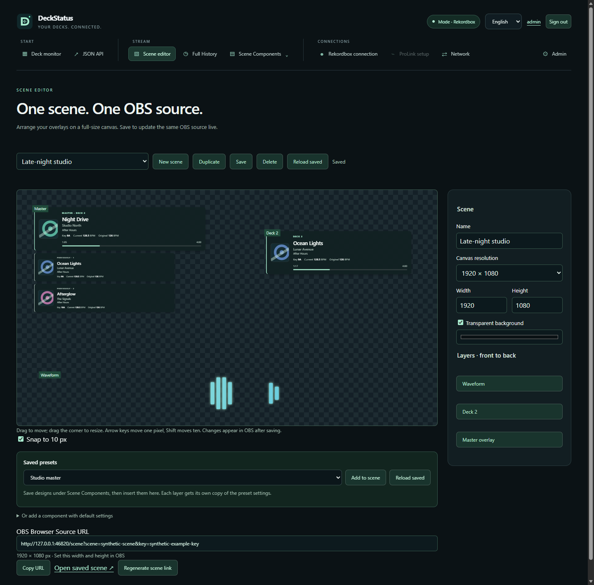

  

<h1 align="center">DeckStatus</h1>

Live DJ metadata, audience ratings and configurable OBS overlays for Windows.

  
  
  
  

  <a href="https://github.com/spartokos99/DeckStatus/releases/latest">📦 Download</a> ·
  <a href="docs/WIKI.md">📖 Technical guide</a> ·
  <a href="CHANGELOG.md">📝 Changelog</a>

  
🧪 Compatibility

  
### 🍦 Rekordbox (Software)

|                    | Windows | macOS |
|:------------------:|:-------:|:-----:|
| Rekordbox 7.2.18.0 |    ✅    |   ✅   |

live-tested only with **Rekordbox 7.2.18.0 Windows x64 installation**.

### 🧰 Pro DJ Link (Hardware)

|             	| **Working** 	| **Note** 	|
|:-----------:	|:-----------:	|:--------:	|
|   **CDJs**  	|             	|          	|
|   CDJ-3000  	|      ✅      	|          	|
|  CDJ-3000X  	|      ✅      	|          	|
|             	|             	|          	|
|  **MIXERS** 	|             	|          	|
|    DJM-A9   	|      ✅      	|          	|
| DJM-900NXS2 	|      ✅      	|          	|
|             	|             	|          	|
|   **AiO**   	|             	|          	|
|    XDJ-AZ   	|      ✅      	|          	|

 ProLink supports CDJ-3000, CDJ-3000X, XDJ-AZ, DJM-A9 and DJM-900NXS2 experimentally.
 No real ProLink hardware has been tested; see the [device and metadata limitations](docs/prolink.md).

## ▶️ Run

1. Extract the full Windows ZIP into a writable folder.
2. Start Rekordbox, then run **DeckStatus.exe**. For ProLink, use **Start-ProLink.cmd**.
3. Open **http://127.0.0.1:18740**.
4. On first start, sign in as **admin** with the temporary password printed in the DeckStatus console. Set a new password, then sign in again.

Stop with **Ctrl+C**. Use `DeckStatus.exe --demo` to explore synthetic tracks without Rekordbox or DJ hardware.

Download the complete Windows package from [DeckStatus v2.0.2](https://github.com/spartokos99/DeckStatus/releases/tag/v2.0.2).

## ✨ Features

- 🎛️ **Four-deck dashboard:** title, artist, album, key, cover, current/original BPM and timelines.
- 🎨 **OBS overlays:** individual decks, current master with adjustable history, and six audio waveform styles. Customise fields, colours, fonts, dimensions, alignment and smooth transitions.
- 💾 **Saved presets:** save, load, update and delete overlays. The library persists on the server and is shared with signed-in users.
- 🧩 **Scene editor:** insert saved presets on a monitor-sized canvas. Drag, resize, reorder and style independent layers; save to update the same OBS source.
- 🎶 **Public Full History:** viewers browse played tracks at `/history` and rate them from 1–5 stars without an account.
- ⭐ **Persistent ratings:** the admin panel shows averages, vote counts and star distributions across sessions.
- 🔐 **Accounts:** administrator/operator roles, user management and required initial password changes.
- 🌐 **Optional LAN access**, JSON API, Rekordbox/ProLink modes and English/German application translations.

🎨 Explore a few overlay styles

Start with a built-in style, customise it and save it as your own preset.

## 🛠️ Build and test

Requires Windows x64, Visual Studio C++ tools, CMake and JDK 21+ for ProLink.

~~~powershell
powershell -NoProfile -ExecutionPolicy Bypass -File build.ps1
node tests/browser_master_test.cjs
node tests/browser_waveform_test.cjs
node tests/browser_dashboard_history_test.cjs
node tests/browser_prolink_test.cjs
node tests/browser_network_test.cjs
node tests/browser_portal_test.cjs
node tests/network_smoke.cjs
~~~

Browser tests require Node.js 22+ and Microsoft Edge. Native tests cover injection fixtures, metadata, HTTP, audio, ProLink, network settings, authentication, ratings, presets, scenes and storage migration. The portal browser test runs the real EXE with isolated data, including preset reuse, anonymous OBS rendering and restart persistence. Automated tests do not establish additional Rekordbox or real ProLink compatibility.

Set `$env:DECKSTATUS_TEST_PROXY='1'` before the portal browser test to run it through an isolated HTTPS proxy, including Secure cookies, local OBS links and same-origin previews. Unset it afterwards with `Remove-Item Env:DECKSTATUS_TEST_PROXY`.

See the [technical wiki](docs/WIKI.md) for setup, permissions, APIs, storage and troubleshooting, and [third-party notices](THIRD_PARTY_NOTICES.md) for dependencies.
