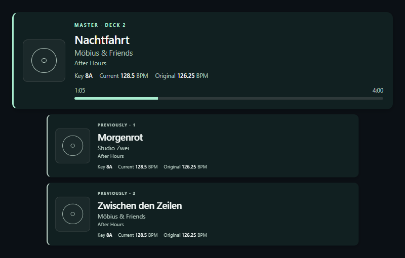
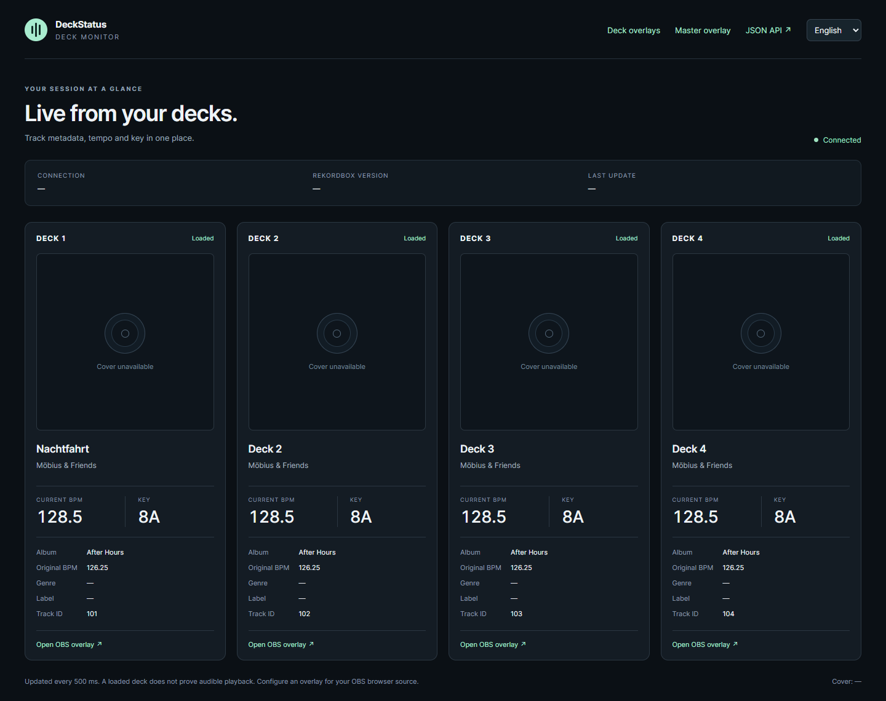
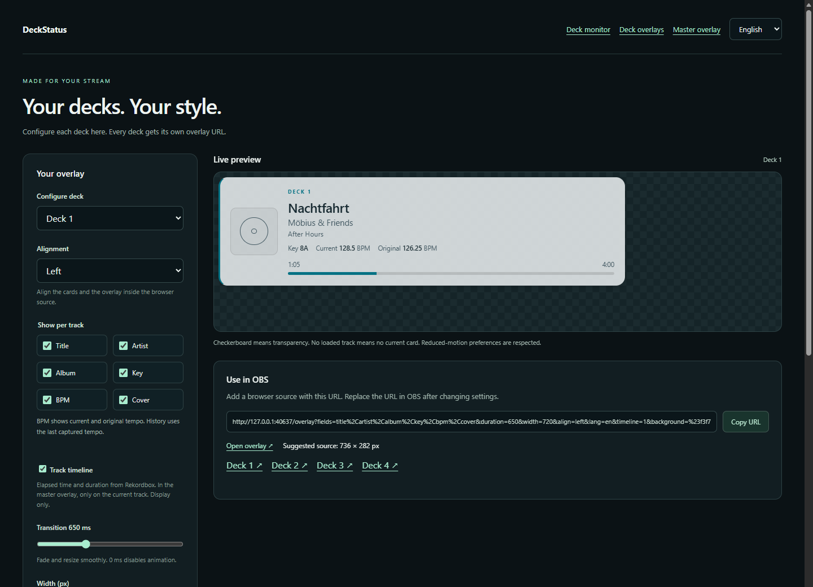
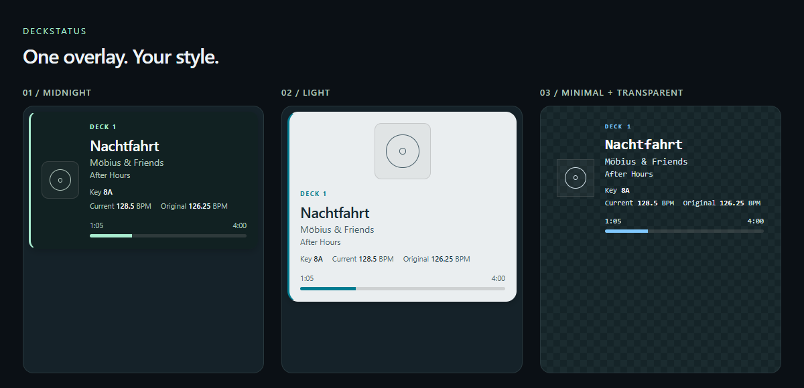

<div align="center">

# 🎛️ DeckStatus

**Live deck data. Custom stream overlays. Your master track and its history.**

🪟 **Windows x64** · ⚡ **C++20** · 🌐 **Local HTTP API** · 🇬🇧 / 🇩🇪 **English & Deutsch**

[🚀 Getting started](#getting-started) · [✨ Features](#features) · [🧪 Tests](#tests-and-validation) · [🌐 HTTP API](#http-api) · [Deutsch](README.de.md)

</div>

> [!IMPORTANT]
> **Tested only with the author's Rekordbox 7.2.18.0 installation on Windows x64.**
> This is a build-specific integration, not general Rekordbox 7 support. No other Rekordbox version, executable build, operating system or Export-mode workflow has been validated.
>
> The bridge checks the executable version, PE build markers, 14 instruction sequences and the objects it reads. A build that does not match is rejected as `unsupported`. Matching version digits alone do not establish compatibility.



*📸 All previews below are rendered from the real interface with synthetic track data. No music, library database or Rekordbox binaries are included.*

## 🎧 What it does

DeckStatus reads the decks in an already-running Rekordbox process and makes their data available through a local web server. Use its dashboard to monitor four decks, add transparent browser-source overlays to your stream, or consume the JSON API in your own tools.

The application consists of two parts: `DeckStatusBridge.dll` samples native deck state inside Rekordbox, while `DeckStatus.exe` handles the HTTP server, history, library metadata and artwork. The injected DLL reads state without calling undocumented Rekordbox functions. Library queries run in the separate host process using a read-only database connection.

<a id="features"></a>

## ✨ Features

### 🎚️ Four decks and a live dashboard

- Track title, artist, album, stored key, genre, label and artwork.
- Current deck BPM **and** original, analysed library BPM.
- Track position, total duration, track ID and the current MASTER designation.
- Connection state, executable version, sample age and metadata diagnostics.
- Missing values remain unknown; stale or disconnected decks are not presented as live.

Native sampling runs approximately every **100 ms**. Overlays poll every **250 ms**, and the dashboard every **500 ms**. Library metadata is refreshed on track changes and periodically thereafter.



### 🖥️ Individual deck overlays

One settings page configures all four decks. Each deck has its own saved configuration and OBS URL; **Apply to all decks** copies a design across them.

Choose whether to show **title, artist, album, key, BPM and cover**, enable the optional timeline, and preview the result before copying the URL. The BPM field includes both current and original tempo.



### 👑 Master overlay and track history

Follow Rekordbox's MASTER-marked deck automatically and keep **0–50 previous tracks** below it.

- Scale previous cards from **0.20× to 1.00×** while the current master remains full size.
- Align the overlay and its history to the **left, centre or right**.
- Smooth fades, movement and resizing with an adjustable **0–2000 ms** transition.
- Live BPM and metadata updates do not restart the track-change animation.
- Reduced-motion preferences disable animation.
- History is collected by the server even without an open browser, and survives browser refreshes.

History records **master-track changes**, not proven audible playback. Moving the same track to another master deck does not duplicate it; playing it again later in the sequence can create a new entry. History keeps the last captured deck BPM and can receive missing metadata later. **Restarting the bridge clears the session history.**

### ⏱️ Optional track timeline

Show elapsed time, total duration and a progress bar. The display uses sampled Rekordbox positions, handles negative preroll and bounds the bar to 0–100%. It does not advance time on its own when no movement is sampled.

In the master overlay, **only the current track shows a timeline**. Historical cards never show it. Missing timing data produces an unavailable state.

The timeline is a visual display: it does not play audio, show a waveform, seek or control Rekordbox.

### 🎨 Make the overlay yours



| Setting | Options |
|---|---|
| Presets | Midnight, Light, Minimal / transparent |
| Colours | Background, primary text, secondary text, accent |
| Background opacity | 0–100% |
| Typography | System sans serif, serif or monospace; title size 14–40 px |
| Cover | 32–180 px; beside or above the text |
| Geometry | Width 320–1600 px, padding, card spacing, corner radius |
| Decoration | Accent border, shadow and deck/master labels |
| Master history | Count, proportional scale and alignment |
| Motion | Transition duration; system reduced-motion support |

Settings are saved in the browser. Generated overlay URLs contain their configuration, including language, so an OBS browser source works independently of the settings page's local storage. Replace the URL in OBS after changing a design.

### 🌍 English and German

**English is the default.** Switch between English and Deutsch in the dashboard or either settings page. Your browser remembers the choice; overlay URLs carry `lang=en` or `lang=de`.

Console help and diagnostics also support both languages through `--lang en|de`. Track metadata is displayed as stored in the library.

### 🧩 Demo mode

Run `DeckStatus.exe --demo` without Rekordbox to try the dashboard, overlays, history and timeline. Two synthetic tracks alternate as master every eight seconds. Demo data is visibly marked.

<a id="getting-started"></a>

## 🚀 Getting started

### 🛠️ Build requirements

- Windows x64.
- Visual Studio 2022/2026 C++ build tools, a Windows SDK and CMake **3.25+**.
- The **Desktop development with C++** workload.
- Optional: Node.js **22+** and Microsoft Edge/Chromium for browser tests.

The recorded build and live validation used **Visual Studio 2026 / MSVC 19.51**. The native application uses the static MSVC runtime; no .NET, Python or Node.js runtime is required to run it. Its C++ header dependencies are included.

### 📦 Build from source

Run from the repository directory:

```powershell
powershell -NoProfile -ExecutionPolicy Bypass -File .\build.ps1
```

The script configures an x64 Release build and runs CTest. The output is in `build\Release`. Alternatively, open `DeckStatus.sln` in Rider/Visual Studio or use `CMakeLists.txt`.

A fresh checkout does not contain the author's local CMake cache. The optional database test is skipped unless an installed Rekordbox executable is configured; see [Tests](#tests-and-validation).

### ▶️ Start DeckStatus

1. Start the **tested Rekordbox build** and switch to Performance mode.
2. Run `build\Release\DeckStatus.exe`.
3. Open [http://127.0.0.1:18740/](http://127.0.0.1:18740/).
4. Load tracks and open the [deck settings](http://127.0.0.1:18740/overlay/settings) or [master settings](http://127.0.0.1:18740/master-overlay/settings).
5. Copy the generated URL into an OBS **Browser Source**, using the suggested source dimensions.

Keep `DeckStatusBridge.dll` and the entire `web` folder beside `DeckStatus.exe`. Run Rekordbox and the bridge as the same Windows user with matching privileges.

Stop with **Ctrl+C**. The DLL stops its worker and unloads. Restart the bridge after restarting Rekordbox; use `--pid` if more than one Rekordbox process is running.

```powershell
.\build\Release\DeckStatus.exe --help
.\build\Release\DeckStatus.exe --lang de
.\build\Release\DeckStatus.exe --port 18741
.\build\Release\DeckStatus.exe --pid 1234
.\build\Release\DeckStatus.exe --database 'D:\DJ Library\master.db'
.\build\Release\DeckStatus.exe --demo
```

### 🧳 Create a portable package

In a shell where `cmake` is available:

```powershell
cmake --install build --config Release --prefix build/DeckStatus
Compress-Archive -Path build/DeckStatus/* -DestinationPath build/DeckStatus-win-x64.zip -Force
```

Generated binaries and ZIP files are intentionally excluded from Git.

### 🔄 Upgrading to DeckStatus

Stop the previous instance before starting `DeckStatus.exe`. Keep the matching `DeckStatusBridge.dll` and `web` directory beside it. On the same browser origin, saved language and overlay settings from earlier builds are copied to the new `deckstatus.*` storage keys automatically. Existing overlay URLs continue to work.

<a id="http-api"></a>

## 🌐 HTTP API

The server listens on **127.0.0.1**. Routes support read-only access; cross-origin browser requests are rejected. The API has no playback-control endpoints.

| Route | Purpose |
|---|---|
| `/` | Four-deck dashboard |
| `/overlay/settings` | Settings, preview and URLs for decks 1–4 |
| `/master-overlay/settings` | Master overlay settings, preview and URL |
| `/overlay?deck=1` | Transparent overlay for deck 1; accepts decks 1–4 |
| `/master-overlay` | Transparent current-master and history overlay |
| `/api/state` | Status, version, diagnostics, timing, master ID and all decks |
| `/api/decks` | Deck array |
| `/api/decks/1` | One deck |
| `/api/decks/1/cover` | Artwork; 404 when unavailable |
| `/api/master` | Current master, newest-first history and session limit |
| `/api/master/covers/{trackId}` | Artwork for a track retained in the master session |
| `/api/health` | 200 when connected or in demo mode; otherwise 503 |

A deck exposes `id`, `trackId`, `loaded`, `metadataAvailable`, `isMaster`, `title`, `artist`, `album`, `key`, `genre`, `label`, `bpm`, `originalBpm`, `positionMs`, `durationMs` and `coverUrl`.

- `bpm` is the current deck tempo; `originalBpm` comes from the library.
- Timing fields are in milliseconds. Position can be negative.
- Unknown data is `null`; `loaded` does not imply audible playback.
- `updatedAt` is Unix time in milliseconds; `sampleAgeMs` indicates freshness.
- Master entries add session-scoped `entryId`, `startedAt` and `endedAt`.
- Cover URLs are track-specific. A URL does not guarantee that an image exists.

Example:

```powershell
Invoke-RestMethod http://127.0.0.1:18740/api/state
Invoke-RestMethod http://127.0.0.1:18740/api/master
```

<a id="tests-and-validation"></a>

## 🧪 Tests and validation

**Recorded live testing is limited to the author's Rekordbox 7.2.18.0 Windows x64 build.** Passing automated tests does not establish support for another version.

All **five native CTest tests** passed in the recorded local validation:

| Test | Coverage |
|---|---|
| `master_history` | Master changes, repeats, gaps, late metadata, captured BPM, history limit, artwork retention and stale samples |
| `artwork_database` | Metadata joins, missing values, UTF-8, artwork paths and bounds; verifies that its temporary database remains unchanged |
| `http_server` | JSON and Unicode, routes and MIME types, Host/Origin checks, read-only methods, artwork races, health states, port ownership and shutdown |
| `scanner_boundaries` | Invalid memory, page boundaries, UTF-8, PE boundaries and ambiguous signatures |
| `injection_lifecycle` | DLL loading, IPC, unsupported-build rejection, duplicate attachment and reattachment in an isolated test process |

The injection test starts its **own fixture process**, named `rekordbox.exe`. It contains no Rekordbox code and does not attach to a user's running Rekordbox instance.

### ⚙️ Run native tests

```powershell
ctest --test-dir build -C Release --output-on-failure
```

To enable the optional database test, configure the path to your **locally installed, tested Rekordbox executable** before building:

```powershell
cmake -S . -B build -A x64 -DREKORDBOX_TEST_EXE="C:/path/to/rekordbox 7.2.18/rekordbox.exe"
cmake --build build --config Release --parallel
ctest --test-dir build -C Release --output-on-failure
```

This test uses the installation's database libraries with a temporary test database. Without that option, `artwork_database` reports **Skipped**.

### 🧭 Run browser tests

```powershell
node tests/browser_master_test.cjs
# Or select another locally installed Chromium/Edge executable:
node tests/browser_master_test.cjs "C:/path/to/msedge.exe"
```

The browser suite launches a headless browser with a private profile and synthetic local HTTP fixtures. It covers:

- Deck-specific persistence, applying settings to all decks and generated OBS URLs.
- English defaults, German/English switching and language fallback.
- Appearance options and actual rendered sizes, scaling, spacing and all three alignments.
- Smooth transitions, rapid track changes, recovery and reduced motion.
- Current/original BPM updates and missing-value handling.
- Timeline progress, preroll, bounds, missing data and master-only visibility.
- Safe text rendering of track metadata and disconnected states.

Screenshots are written to `build/test-artifacts`.

### 🔬 What was checked live

Four loaded decks supplied metadata, artwork, tempo and timing. Native device values were compared with API output. Master changes and retained artwork were observed, and the real server was checked in Edge.

Live timeline validation used **stationary positions**. Seek jumps, negative preroll and pause-display behaviour were tested with synthetic browser data. Manual pitch changes, a dedicated OBS run, streaming-service tracks, Export mode, other Rekordbox versions and extended DJ sessions have **not** been separately validated.

See [the validation record](docs/validation.md) and [the exact executable profile](docs/rekordbox-7.2.18.md) for the evidence and its limits. These detailed engineering notes are currently in German.

## ⚠️ Compatibility and limitations

The tested executable is **7.2.18.0**, Windows AMD64, with the documented SHA-256:

```text
a99896cf26d5998e6ad4177796a467b83df14bf8ae7207df21ed01251e402493
```

The hash is a reference fingerprint; the DLL does not calculate SHA-256 at runtime. Its runtime guards are documented in the executable profile.

- MASTER follows Rekordbox's UI designation, including when that deck is paused.
- Play/pause state, fader position, audible output and live-transposed key are not detected.
- Streaming tracks without local library metadata or artwork may have missing fields.
- The application reads the library and artwork; it does not modify the collection or audio files.
- Executable updates require a separately investigated and validated memory profile.

## 🗂️ Project layout

```text
src/        Native bridge, injector, HTTP server, metadata and history
web/        Dashboard, settings, overlays and EN/DE translations
tests/      Native fixtures and browser integration suite
docs/       Validation, executable profile and metadata-source notes
vendor/     Bundled header dependencies and their licences
build.ps1   Windows build and CTest entry point
```

## 🤝 Credits

Bundled dependencies are **cpp-httplib 0.20.0** and **nlohmann/json 3.12.0**, under their respective MIT licences. Interoperability references and the notice for the pyrekordbox-derived constants are listed in [THIRD_PARTY_NOTICES.md](THIRD_PARTY_NOTICES.md) and [metadata source notes](docs/artwork-sources.md).

Rekordbox binaries, music, library databases and the local research checkout are not distributed. This is an independent project and is not affiliated with or endorsed by AlphaTheta / Pioneer DJ.
