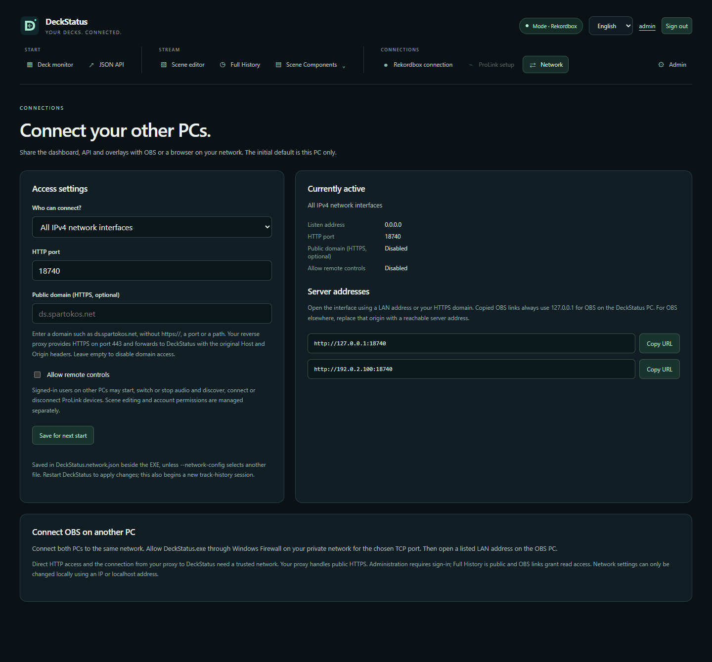

# Network access

Network access is optional and works in both modes. With no saved configuration or command-line override, DeckStatus listens only on `127.0.0.1:18740`.

## Configure in the web interface

1. On the DeckStatus PC, open **Connections → Network** (`/network/settings`).
2. Choose **This PC only**, **All IPv4 network interfaces**, or **One network interface**. The last option lists the PC's active IPv4 adapters.
3. Choose the HTTP port (1–65535; default 18740).
4. Optionally enable **Allow remote controls** if other PCs should manage audio capture or ProLink connections.
   For HTTPS through a reverse proxy, optionally enter a **Public domain**, for example `ds.spartokos.net`. See [HTTPS and Caddy](#https-and-caddy).
5. Click **Save for next start**, stop DeckStatus and start it again. Restarting starts a new track-history session.
6. Open a displayed LAN address or the configured HTTPS domain. Copied OBS links always use `http://127.0.0.1:<port>` for OBS running on the DeckStatus PC. For OBS on another PC, replace that origin with the reachable LAN/HTTPS address while keeping the complete path and query.

The page shows active and saved settings separately. Saving does not interrupt the current stream. Only administrators can inspect network settings; editing additionally requires a direct IP/localhost request from the DeckStatus PC. Requests through the public domain use remote permissions, even when the proxy runs on the same PC. Forwarding headers never grant permissions. See the [technical wiki](WIKI.md) for accounts, public history and OBS access keys.



## Access levels

| Setting | Result |
|---|---|
| This PC only | Other PCs cannot connect; local audio/ProLink controls remain available |
| Network access, remote controls off | Authenticated clients can use their account permissions; audio/ProLink control from another PC is disabled. Full History remains public. OBS keys allow their matching read routes. |
| Network access, remote controls on | Administrators on other PCs can additionally save audio settings and start/switch/stop capture; authenticated operators/admins can discover/connect/disconnect ProLink devices |

Signed-in clients can edit overlay designs and shared scenes. The remote-controls switch affects audio/ProLink controls, not scene editing or user-management permissions. Blocked source-control requests receive HTTP 403.

Use trusted networks for direct HTTP and the proxy-to-DeckStatus connection: **HTTP traffic is not encrypted**. `0.0.0.0` listens on every IPv4 interface, including VPN adapters. Selecting one interface also keeps a listener on `127.0.0.1` at the same port, so local OBS links and `localhost` remain usable. Both listeners share the same accounts, scenes, history and audio state. If either required port cannot be bound, startup fails. Host and same-origin checks remain enabled; IPv6 listeners are not included.

## HTTPS and Caddy

1. On the DeckStatus PC, open Network settings using its IP or localhost address and sign in as an administrator.
2. Enter `ds.spartokos.net` in **Public domain (HTTPS, optional)**. Enter the domain only, without `https://`, a port or a path. Save and restart DeckStatus.
3. Point the domain's DNS at your Caddy server. Configure Caddy to terminate HTTPS on port 443 and forward HTTP to the DeckStatus listener:

   ```caddyfile
   ds.spartokos.net {
       reverse_proxy 192.168.0.221:18740
   }
   ```

4. Open `https://ds.spartokos.net`. Public history is available at `https://ds.spartokos.net/history`. The copied deck, master, waveform and scene URLs still use `http://127.0.0.1:18740` for local OBS; previews use the address currently open in your browser.

Keep the original **Host** and **Origin** headers. Remove earlier `header_up Host ...` or Origin rewrites; Caddy forwards these headers by default for an HTTP upstream. Caddy manages the public certificate; DeckStatus continues listening on its selected HTTP port. If Caddy runs on the same PC, its upstream can instead be `127.0.0.1:18740` with DeckStatus in local-only mode. If it runs on another PC, use the reachable LAN interface and allow its TCP connection through Windows Firewall. See [Caddy's reverse proxy documentation](https://caddyserver.com/docs/caddyfile/directives/reverse_proxy).

The setting does not change DNS, open ports or install a certificate. It allows only the exact domain (also accepting an explicit default `:443`), with a matching HTTPS Origin when present. HTTP Origins, other ports and wildcard/subdomain matches stay blocked. Session and Twitch viewer cookies on the domain use `Secure`; direct IP/localhost cookies keep their HTTP behavior. Clear the domain and restart to disable domain access. Existing settings files without `publicDomain` retain their original behavior.

Domain requests respect **Allow remote controls**, including when Caddy connects from localhost. Network settings remain read-only through the domain. `Forwarded` and `X-Forwarded-*` are not trusted for host/origin validation or local privileges. Rate limits use the actual TCP peer, so clients behind the same proxy share IP-based limits. International domain names must use ASCII/punycode. HTTPS ports other than 443 and hosting under a path prefix are not supported.

## Firewall and OBS

Both PCs must have a route to one another. Allow **DeckStatus.exe** through Windows Firewall on the private network for the selected **TCP** port. DeckStatus does not create firewall rules or router port forwards. Do not expose the service to the internet.

For OBS on the DeckStatus PC, copy an overlay/scene URL directly into an OBS Browser Source. For OBS on another PC, replace `http://127.0.0.1:18740` in that URL with the DeckStatus PC's LAN address or configured HTTPS origin, retaining its path, options and access key. `127.0.0.1` always refers to the PC running OBS. Browser preferences stored under localhost, LAN and the domain use separate origins.

HTTP LAN pages may not support the clipboard API. The copy buttons then select the URL and ask you to press Ctrl+C.

The audio source belongs to the **DeckStatus PC**, even when viewed elsewhere. ProLink's Java firewall requirements are separate from the HTTP port; see [ProLink setup](prolink.md).

## Command line and persistence

```powershell
# All IPv4 interfaces; remote controls use the saved value (initially off).
.\DeckStatus.exe --bind 0.0.0.0

# One interface and a different port.
.\DeckStatus.exe --bind 192.168.1.20 --port 18741

# ProLink with remote controls explicitly enabled.
.\DeckStatus.exe --mode prolink --bind 0.0.0.0 --allow-remote-control

# Override saved LAN access for this launch.
.\DeckStatus.exe --bind 127.0.0.1

# Separate settings file for a separate instance.
.\DeckStatus.exe --network-config 'D:\DeckStatus settings\network.json'
```

UTF-8 JSON is stored in `DeckStatus.network.json` beside the EXE, or the file selected by `--network-config`. Its folder must exist and be writable to save settings. Initial values:

```json
{
  "bind": "127.0.0.1",
  "port": 18740,
  "allowRemoteControl": false,
  "publicDomain": ""
}
```

Command-line options override supplied fields for that launch without rewriting the file. Remove conflicting arguments on the next launch to use saved values. `--allow-remote-control` enables remote controls; otherwise the saved value applies. Turn it off persistently on the page or in JSON.

Failed saves preserve the previous file through temporary-file replacement. Invalid/unreadable configurations stop startup with a diagnostic. An unavailable selected IP or occupied port causes a bind failure instead of opening another interface. Correct or rename the configuration file to recover. The standard configuration filename is excluded from Git; portable packages contain no saved network configuration.

## Validation

`network_access` covers validation, legacy settings, domain normalization/removal, persistence, failed-save preservation, CLI precedence, Host/Origin restrictions, simultaneous interface/loopback access and local/remote/proxy policies. Additional source-bound remote HTTP checks run when Windows permits that socket arrangement.

`node tests/browser_network_test.cjs` covers the page, domain saving/removal, HTTPS URLs, restart notices, unsaved edits during polling, address/port selection, safe adapter names, EN/DE, mobile layout, connection failure and disabled remote controls.

Run the real EXE/browser suite through an isolated HTTPS reverse proxy with:

```powershell
$env:DECKSTATUS_TEST_PROXY = '1'
node tests/browser_portal_test.cjs
Remove-Item Env:DECKSTATUS_TEST_PROXY
```

This checks login, required password changes, Secure cookies, public history and Twitch-required voting, presets/scenes, local OBS links, same-origin previews, anonymous scene rendering and restart persistence. The fixture creates a temporary certificate and maps a test domain only inside its disposable Edge process; it does not change system DNS or certificate trust. It uses Node TLS termination with Caddy-compatible HTTP forwarding, not a real Caddy deployment.

`node tests/network_smoke.cjs [PATH_TO_BUILD_OR_EXTRACTED_PACKAGE]` launches the real EXE with isolated configuration files, saves settings and restarts it in both modes, checks CLI precedence and requests the host's actual LAN address. It uses demo metadata or an idle ProLink source, never production injection, device connection or audio capture.

The host's LAN URL was checked locally. A second physical PC and its OBS Browser Source have not been validated. Existing Rekordbox and ProLink compatibility limits remain unchanged.
